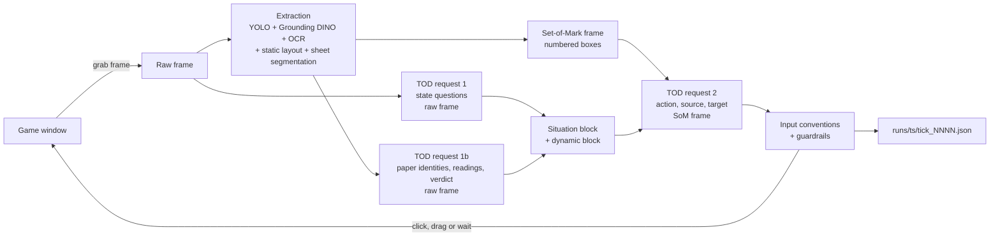
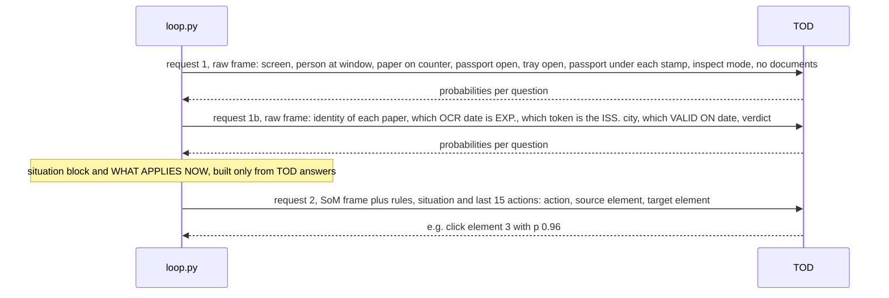
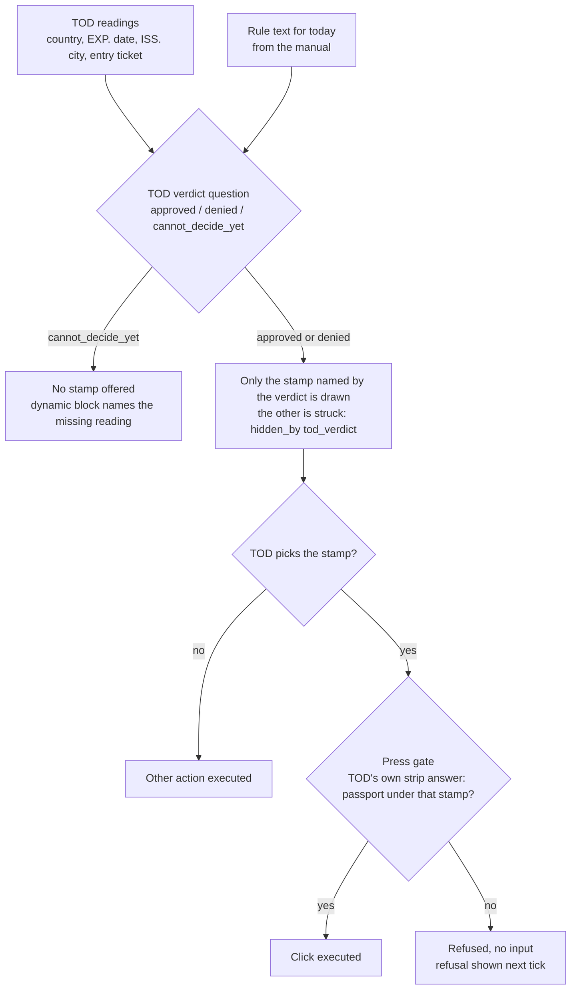

# tod_papers -- TOD plays *Papers, Please*

**TOD** is a decision API from Dasein Labs / parseclab ([docs](https://parseclab.ai/tod/docs/)).
A request is one image, some text, and one or more questions, each with labelled choices; the
answer is a probability distribution over each question's choices.

This repo connects TOD to *Papers, Please* (Story mode, Days 1-3) with a loop where **every
in-game decision is TOD's**: which element to click or drag, where to drop it, what each paper
is, what the passport says, and whether the entrant is approved or denied. The code around TOD
only sees the screen, turns it into labelled options, asks, and executes the answer.

**Claim demonstrated:** a general decision model, given only what is on screen plus the written
rules, can play a rules-heavy document-inspection game through Day 3. In the reference run
[`20261004_115735`](#results) it reached Day 3's end: 13 entrants, 10 handled correctly, 3
citations, and the no-documents entrant interrogated through the game's inspect-mode sequence.

Contents: [Non-negotiables](#non-negotiables) · [Architecture](#architecture) ·
[Extraction](#extraction) · [Set-of-Mark and option text](#set-of-mark-and-option-text) ·
[Question design](#question-design) · [Input conventions](#input-conventions) ·
[Guardrails](#guardrails) · [Ground truth](#ground-truth-evaluation-only) · [Results](#results) ·
[Limitations](#limitations) · [How to verify TOD made the decision](#how-to-verify-tod-made-the-decision) ·
[Teach TOD your own game](#teach-tod-your-own-game) · [Setup and running](#setup-and-running) ·
[Dev log](docs/devlog.md)

---

## Non-negotiables

These rules define the experiment. A change that breaks one of them is out of scope.

1. **TOD decides.** Every click, drag, drop target, paper identity, reading and verdict is the
   top answer to a TOD question. No other model picks inputs.
2. **Options only come from the screen.** Every choice is a box found by extraction on the
   current frame (or a fixed screen region that is visibly there, such as the empty counter).
3. **One image per request.** Each TOD request carries exactly one frame.
4. **No scripted sequences.** There is no hard-coded order of clicks. The rules are written down
   as text; TOD reads them every tick.
5. **No fixed coordinates as actions.** Coordinates are only used to *draw* options (static
   layout fixtures, derived drop zones). Which one is used is TOD's pick.
6. **Nothing leaked into option text.** An option says what the element *is* and where it is
   (OCR text, label, TOD's own earlier identity answer). It never says "this is the right one".
7. **Ground truth is never shown to TOD.** The game-memory reader (`gt.py`) is used for scoring
   and for the harness's stop condition only.

## Architecture

### One tick



Request 1 runs in parallel with extraction. Request 1b needs the extracted boxes (it asks about
each paper and about OCR'd candidate strings). Request 2 needs both. Each request carries one
image. Every answer, probability, option text and executed input is logged per tick.

### The two kinds of request



### From facts to a stamp press



The rule is applied by TOD, not by code: the verdict question states today's rule and lists
TOD's own earlier readings; code only displays them and gates the press on TOD's own strip answer.

## Extraction

`src/tod_papers/extract.py` (+ `layout.py`, `extract_server.py` for a GPU box). Output: a list
of boxes, each with a kind, a label or OCR text, and a position; `describe(box)` turns a box into
option text. Details and comparison tables: [docs/extraction.md](docs/extraction.md).

| piece | what it produces | why it exists |
|---|---|---|
| **YOLO icon detector** (OmniParser v2 `icon_detect`) | class-agnostic UI element boxes | finds buttons, stamps, the horn, the tray tab without a game-specific model |
| **Grounding DINO** (open vocabulary) + CLIP labels | a label per untexted box ("yellow lever", "rubber stamp", "speaker/horn", "passport booklet", "folded page corner", ...) | a box without text or label gave TOD nothing to match; with labels the idle-booth pick went from ~0.2 (bulletin) to 0.71-0.75 (horn) |
| **OCR** (PP-OCRv5 via RapidOCR, line crops upscaled 3x nearest-neighbour) | text lines with boxes | the game's pixel font; OCR text goes into option text and into reading candidates |
| **Static layout finder** (`layout.py`) | fixtures that are always at the same native-pixel place: stamp tray tab, stamp bar, counter, inspect button, empty counter, microphone, day tiles | YOLO misses some of these on some frames; they are drawn as options only when the screen state shows them, and TOD chooses them like any other box |
| **Derived drop zones** | stamp landing strips (from the detected stamp heads), the entrant (largest person box), the put-away spot, the rulebook slot | drop targets must be the places that matter in the game; a single "empty space" target failed |
| **Sheet segmentation** | one box per paper when papers overlap (passport vs entry ticket vs flyer), each with its own OCR text | an identity question per paper needs one paper per box |

Local extraction on an RTX 4070 takes 0.5-0.8 s on a quiet machine and 2-5 s with the game
running; the same server on a cloud L4 is about 1.1 s per tick round trip
([docs/remote_extraction.md](docs/remote_extraction.md)).

## Set-of-Mark and option text

`som.py` draws a numbered marker on every box offered this tick; boxes ruled out (no effect
twice, or hidden by a guardrail) are struck through. The numbers are the choice labels of the
request-2 `source` and `target` questions, and each number's criteria text is the box's
description. Real option texts from run `20261004_115735`, tick 22:

```
1  object - shutter lever at the top-right corner of the booth window -- drag it down to open
   or close the window shutter (middle-left) - drag
3  object - green APPROVED stamp (knob and body) on the open tray -- click it to stamp the
   passport lying in the strip beneath it (middle-right) - click (press to stamp)
7  drop target - stamp landing strip (under the APPROVED stamp head)
```

Paper boxes carry TOD's own identity answer from request 1b, e.g. `passport 0.86 -- <position>`.
The option says what the element is; it does not say whether to use it.

## Question design

All questions are in `manual.py` (text) and `loop.py` (when they are asked).

**State facts (request 1, raw frame).** `screen` (menu, bulletin, booth_idle,
documents_on_desk, stamp_tray_open, inspect_mode, day_end, ...), `person_at_window`,
`document_on_counter_shelf`, `document_open_on_desk`, `stamp_tray_open`,
`passport_under_denied` / `passport_under_approved`, `inspect_mode_on`,
`no_documents_presented`, `photo_matches_person`, `rulebook_page`. Yes/no questions are TOD
"noul" questions (probability of yes).

**Per-paper identity (request 1b).** One question per paper box, with that box's OCR text in
the question: passport / rulebook / bulletin / entry_ticket / transcript / flyer / citation /
other. Tick 22: `doc0 = passport (p 0.895)`.

**Readings as choices over OCR'd candidates (request 1b).** TOD is not asked "is it expired?";
it is asked which of the strings OCR found is the one that matters:

```
exp_date:    "OCR found these dates on the documents on the desk. On the open passport data
              page, which one is printed after 'EXP.'?"
              D1 = EXP. 1925.10.19   D2 = EXP. 1984.02.17   none
              -> D2 (p 0.955)
ticket_date: "OCR read these 'VALID ON' lines on the desk. On the ENTRY TICKET ..., which one
              is printed after 'VALID ON'?"   D1 = VALID ON 1982.11.25   none  -> D1 (p 0.994)
issuing_country: ARSTOTZKA / KOLECHIA / IMPOR / ANTEGRIA / OBRISTAN / REPUBLIA /
              UNITED FEDERATION / unreadable  -> OBRISTAN (p 0.835)
```

This moved offline expiry accuracy from 3/30 to 28/30 and city from 26/30 to 29/30.

**Verdict (request 1b).** A choice `approved / denied / cannot_decide_yet`. The question text is
today's rule plus TOD's own earlier readings of this entrant:

```
TODAY'S RULE: Day 3 (1982.11.25): ... APPROVED if the passport is valid: it is not expired (its
EXP. date is after 1982.11.25) AND its ISS. city is in the rulebook list for the passport's
country ... a foreigner also needs an ENTRY TICKET VALID ON 1982.11.25 ...
YOUR OWN EARLIER READINGS of this entrant's papers:
- issuing country: OBRISTAN (your answer at tick 20, p=0.83)
- EXP. date: 1984.02.17 (your answer at tick 20, p=0.95)
- ISS. city: 'Lorndaz' (your answer at tick 20, p=0.94)
- entry ticket: dated_today (your answer at tick 20, p=0.99)
-> approved (p 0.768)
```

**Action (request 2, SoM frame).** `action` (click / drag / wait), `source` (numbered elements +
wait), `target` (numbered drop targets). The text is the ~2.4k-character rules manual
(`BOOTH_MANUAL`), the situation block (TOD's answers, each labelled "your reading"), a short
"WHAT APPLIES NOW" dynamic block derived from those answers, and the last 15 actions with their
observed effect. Tick 22's dynamic block:

```
WHAT APPLIES NOW (from your own answers above):
- Your verdict (this tick): APPROVED p=0.77. The passport lies under APPROVED: press the
  APPROVED stamp once.
```

TOD's answer: `action = click (0.89)`, `source = 3 (0.96)` -> the APPROVED stamp was pressed.

## Input conventions

Some elements are press-only (stamps, buttons, the horn, page corners) and some are drag-only
(papers, the tray tab, the lever). This is the game's input model, not a decision: if TOD picks
`drag` on a stamp, the press is executed as a click; if it picks `click` on a paper, the drag
goes to TOD's chosen target. Each coercion is logged in `input_convention` /
`convention_mismatch`. The element and the target are always TOD's.

## Guardrails

Guardrails remove options or refuse an input. They never choose one. Each keys on TOD's own
answers:

| guardrail | keyed on |
|---|---|
| only the verdict's stamp drawn (`stamp_hidden`) | TOD's `verdict` answer |
| press gate (refused press) | TOD's `passport_under_<side>` answer |
| horn hidden while someone is at the window | TOD's `person_at_window` |
| stowed flyers / citations struck | TOD's identity answer for that paper |
| stuck detection: an element with no visible effect twice is struck for 6 ticks | measured pixel change after the input |
| repeat-drag ban, tray open/close limit | the action history |
| delete / trash veto on menu screens (only remaining regex) | OCR text of the option |
| stop flags `--stall-stop`, `--pick-stop`, `--refuse-stop`, `--stop-on-screen` | repeated state / picks / refusals |

## Ground truth (evaluation only)

`src/tod_papers/gt.py` reads the game's memory (Unity IL2CPP; offsets in
[docs/ground_truth.md](docs/ground_truth.md)): screen, day, clock, entrant name, the correct
verdict, the verdict given, error classes, processed count, citations, savings. It is written to
each tick JSON under `gt` and used by `tools/report.py` for scoring and by the harness to stop at
a given day's night screen. It never appears in any TOD request text.

## Results

Scored by ground truth. "given" counts entrants that received a stamp (or, for the no-documents
entrant, were interrogated). Days 1-2 rows are from runs that continued into later days.

| day | run | entrants reached | given | correct | notes |
|---|---|---|---|---|---|
| 1 | `20261003_092642` | 8 | 7 | 7 | `--pause-think` |
| 1 | `20261003_182519` | 4 | 3 | 3 | no pause |
| 2 | `20261003_182519` | 7 | 6 | 6 | no pause |
| 2 | `20261003_092642` | 7 | 5 | 4 | photo look-alike approved |
| 3 | **`20261004_115735`** | 13 | 12 + interrogation | **10** | reached Day 3 night; 3 citations |

Reference run `20261004_115735`: 254 ticks, 684 TOD calls, $0.31 in TOD calls, median
extract 1.09 s, request 2 1.47 s, `--pause-think`. The three citations: an OCR misread city
(`Passport/IssuingCity`), a look-alike photo approved (`Passport/Face`), an OCR misread expiry
date. The no-documents entrant: rulebook to desk (t132) -> Basic Rules (t133) -> inspect button
(t134) -> rule line "Entrant must have a passport" (t135) -> empty counter (t136) -> microphone
(t138) -> "Where is your passport?" (t139); he left without a stamp or a citation.

`python tools/report.py runs/<run>` prints this table for any run.

## Limitations

- **Photo check.** Denying on the photo needs a confident `different`; look-alikes get approved.
- **OCR misreads.** The pixel font occasionally yields `Eist Grestin` or `1943.11.25`; TOD then
  reads the wrong string correctly.
- **Clock vs. tick time.** A tick takes 6-10 s (three TOD calls plus extraction); the game day is
  ~4 real minutes. Without help, entrants after 18:00 are unpaid and Day 2 can end in debt.
- **`--pause-think`.** The harness can suspend the game process while TOD thinks (no input, no
  menu; the frame TOD sees is from before the suspend). The reference Day 3 run used it. It is a
  timing aid, off by default, and visible as stutter in recordings.
- Step N (no documents) re-runs for ~8 ticks after the interrogation starts.
- Days 4+ are not attempted.

## How to verify TOD made the decision

Every tick writes `runs/<ts>/tick_NNNN.json`, plus `raw_NNNN.png` (the unmarked frame of
requests 1/1b) with `--save-raw` and, in current code, `tick_NNNN.png` (the numbered SoM frame of
request 2). Read, for any tick:

| field | what it shows |
|---|---|
| `state_text` | the full request-2 text TOD received (rules, situation, dynamic block, history) |
| `descriptions` | the option text for every numbered element |
| `answers` | TOD's raw probabilities for `action`, `source`, `target`, `screen` |
| `tod_pick` | the argmax that was used; compare with `answers` |
| `state` | every request-1 / 1b answer with `value`, `p`, and the full `probs` (incl. `verdict`, `doc0..`, `exp_date`, `ticket_date`) |
| `stamp_hidden`, `excluded` | which options were struck and why (keyed on TOD answers or no-effect) |
| `input_convention`, `convention_mismatch` | any click/drag coercion |
| `executed`, `changed` | the input actually sent and whether the screen changed |
| `tod_request_id`, `tod_ms` | the TOD request id and latency for request 2 |
| `gt` | ground truth for scoring; compare it with `state_text` to confirm it never appears there |

Check: `tod_pick` equals the argmax of `answers.source` / `answers.target`; `executed` names the
same element; no `gt` value (entrant name, `correct`) occurs in `state_text`. `tools/viewer.py`
shows the same fields side by side with the frame, live or for a past run
([docs/viewer.md](docs/viewer.md)).

## Teach TOD your own game

The loop is game-specific only in four files. To adapt it:

1. **Capture and input** (`io_win.py`). Find the window, grab the client area, send clicks and
   interpolated drags. Reuse as is for any Windows game.
2. **Extraction** (`extract.py`). Run it on a few saved frames and look at the SoM image. Every
   element a player would use must have a box *and* a description. Add Grounding DINO prompts for
   untexted objects in your game; add OCR upscaling if the font is pixel art.
3. **Fixtures** (`layout.py`). For elements that never move but are hard to detect, add a static
   box in native coordinates, drawn only when the screen state (a TOD answer) says it is visible.
   Add derived drop zones for the places where drops matter.
4. **Rules** (`manual.py`, `BOOTH_MANUAL`). Write the rules a new player would need, as rules,
   not as a sequence of steps. Keep it short (ours is ~2.4k characters); long scripts made answers
   worse and eventually hit the request size limit.
5. **State questions** (`manual.py`, request 1). One question per fact that changes what to do:
   screen kind, who is present, where the key objects are. Ask them on the raw frame, separately
   from the action question.
6. **Readings** (request 1b). For anything to be read off a document, give TOD the OCR'd
   candidate strings as choices plus `none`, rather than a yes/no about the conclusion.
7. **Decision questions.** If the game has a judgement (approve/deny), make it a TOD question
   whose text contains the rule and TOD's own earlier readings; offer only the inputs that carry
   out that judgement.
8. **Dynamic block.** Per tick, derive one or two sentences from TOD's answers ("your verdict is
   X; the passport is under X") and put them right before the history.
9. **Evaluation.** Get ground truth from somewhere other than the screen (memory, logs, a save
   file) and keep it out of every request. Score with it; dry-run fixes offline on saved frames
   (`loop.py --frames ...`) before going live.

## Setup and running

Windows 11, Python 3.13, an NVIDIA GPU (or the remote extractor), *Papers, Please* on Steam
(AppID 239030) in a 2280x1280 window. A TOD API key in `.env` as `TOD_API_KEY=...` (gitignored).

```bat
:: extraction stack (GPU)
py -3.13 -m venv .venv-extract
.venv-extract\Scripts\python -m pip install torch torchvision --index-url https://download.pytorch.org/whl/cu126
.venv-extract\Scripts\python -m pip install -r requirements-extract.txt
.venv-extract\Scripts\python deploy\fetch_models.py

:: loop venv, layered on .venv-extract (see the header of requirements-loop.txt)
py -3.13 -m venv .venv-loop
.venv-loop\Scripts\python -m pip install --no-deps -r requirements-loop.txt

:: ground-truth reader (evaluation only)
py -3.13 -m venv .venv-gt
.venv-gt\Scripts\pip install -r requirements-gt.txt
```

Extraction runs in-process by default. To use a GPU server instead:

```bat
python -m tod_papers.extract_server --host 0.0.0.0 --port 8765   :: on the GPU box (or deploy/)
set TOD_EXTRACT_URL=http://127.0.0.1:8765                        :: in the loop's shell
```

`deploy/` has a Dockerfile, a Modal app and a GCP L4 spot script
([docs/remote_extraction.md](docs/remote_extraction.md)).

Run:

```bat
.venv-loop\Scripts\python tools\demo_run.py                  :: fresh story, Day 1 -> Day 3 night
.venv-loop\Scripts\python tools\demo_run.py --from-day 3     :: keep saves, TOD picks the day tile
.venv-loop\Scripts\python -m tod_papers.loop --max-ticks 400 --save-raw --stall-stop 12
.venv-loop\Scripts\python -m tod_papers.loop --frames runs\<ts>\raw_0022.png --day 3   :: offline, no input
.venv-loop\Scripts\python tools\report.py runs\<ts>           :: per-entrant table, timings
.venv-loop\Scripts\python tools\viewer.py --run runs\<ts>     :: frame + TOD answers, live or replay
```

More: [docs/demo.md](docs/demo.md) (demo run), [docs/viewer.md](docs/viewer.md) (viewer), [docs/loop.md](docs/loop.md) (tick, flags, decision path), [docs/game.md](docs/game.md)
(game rules and UI), [docs/io.md](docs/io.md), [docs/extraction.md](docs/extraction.md),
[docs/ground_truth.md](docs/ground_truth.md), [docs/devlog.md](docs/devlog.md).

## License

Apache-2.0, see [LICENSE](LICENSE). *Papers, Please* is (c) 3909 LLC and is not included; you
need your own copy. The repo ships only small UI crops used for template matching
(`layout_assets.npz`, `rulebook_corner.png`). Contributions: [CONTRIBUTING.md](CONTRIBUTING.md).
